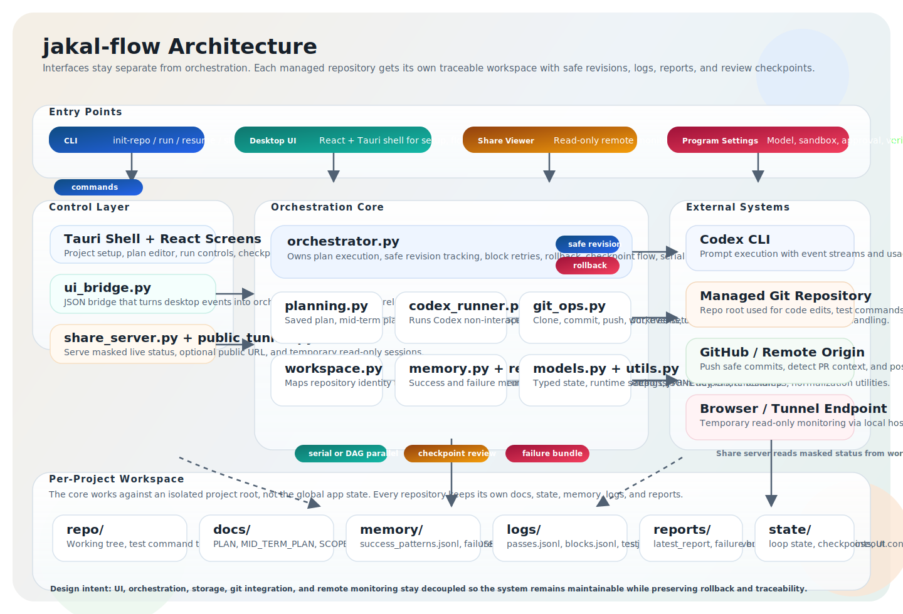

# jakal-flow (한국어)

`jakal-flow`는 격리된 워크스페이스 안에서 여러 저장소를 관리하고, Codex CLI 기반 개선 루프를 반복 실행할 수 있게 설계된 Python CLI입니다.

이 프로젝트의 대표적인 실제 사용 사례 중 하나는 [`Ahnd6474/lit`](https://github.com/Ahnd6474/lit) 같은 저장소를 대상으로, 일회성 수정이 아니라 계획, 체크포인트, 롤백 안전성, 리포트를 포함한 다중 블록 자동화 루프를 지속적으로 돌리는 것입니다.

- OpenAI/Codex 클라우드 모델
- OpenRouter/OpenCDK 같은 OpenAI 호환 제공자
- Codex OSS 모드 및 로컬 OpenAI 호환 서버

를 포함한 다양한 실행 구성을 지원합니다.

## 흐름도



영문 문서는 [README.md](README.md)를 참고하세요.

## 주요 사용 사례

- [`Ahnd6474/lit`](https://github.com/Ahnd6474/lit) 같은 핵심 저장소를 여러 안전한 실행 블록에 걸쳐 지속적으로 개선
- 여러 저장소를 동시에 관리하면서 계획, 로그, 메모리, 리포트, 롤백 상태를 서로 섞지 않음
- OpenAI/Codex 클라우드, OpenAI 호환 제공자, 로컬 OSS 백엔드에 같은 Codex 기반 워크플로를 적용
- 데스크톱 UI로 진행 상황을 보면서도 Python 중심 자동화 백엔드와 구조화된 프로젝트 이력을 유지

## 프로젝트 레이아웃

```text
workspace_root/
  projects/
    <repo_slug>/
      repo/
      docs/
      memory/
      logs/
      reports/
      state/
      metadata.json
      project_config.json
```

## 설치

```bash
python3 -m venv .venv
source .venv/bin/activate
python -m pip install -e .
```

이 저장소 문서는 Linux 개발 환경을 기준으로 작성합니다.

- 예시는 `python3`, `source .venv/bin/activate`, POSIX 셸 명령을 사용합니다.
- 데스크톱 UI 개발에는 Node.js 20+, Rust, 그리고 배포판에 맞는 Tauri용 WebKitGTK 또는 GTK 계열 시스템 패키지가 필요합니다.
- Windows에서는 아래 명령을 그대로 복붙하기보다 PowerShell 또는 CMD 문법에 맞게 바꿔서 실행해야 합니다.

## 자주 쓰는 명령

관리 저장소 초기화:

```bash
python -m jakal_flow init-repo \
  --repo-url https://github.com/Ahnd6474/lit.git \
  --branch main \
  --workspace-root .jakal-flow-workspace \
  --model gpt-5.4 \
  --effort high \
  --approval-mode never \
  --sandbox-mode workspace-write \
  --test-cmd "python -m pytest"
```

개선 루프 실행:

```bash
python -m jakal_flow run \
  --repo-url https://github.com/Ahnd6474/lit.git \
  --branch main \
  --workspace-root .jakal-flow-workspace \
  --model gpt-5.4 \
  --effort high \
  --approval-mode never \
  --sandbox-mode workspace-write \
  --test-cmd "python -m pytest" \
  --max-blocks 2
```

기존 관리 저장소 재개:

```bash
python -m jakal_flow resume \
  --repo-url https://github.com/Ahnd6474/lit.git \
  --branch main \
  --workspace-root .jakal-flow-workspace \
  --model gpt-5.4 \
  --effort high \
  --approval-mode never \
  --sandbox-mode workspace-write \
  --test-cmd "python -m pytest" \
  --max-blocks 1
```

## 데스크톱 UI

데스크톱 UI는 `desktop/`(React + Tauri)에 있습니다.

개발 실행:

```bash
cd desktop
npm install
npm run tauri:dev
```

Linux 데스크톱 패키지 빌드:

```bash
cd desktop
npm install
npm run tauri build
```

Linux 번들 결과물은 `desktop/src-tauri/target/release/bundle/` 아래에 생성됩니다. 일반적인 Linux 환경에서는 `.deb`, `.rpm`이 만들어지고, 호스트 도구가 갖춰져 있으면 AppImage도 함께 생성될 수 있습니다.

프론트엔드 화면만 빠르게 확인하려면:

```bash
cd desktop
npm install
npm run dev
```

## Linux 빠른 시작

가상환경을 만들고 패키지를 설치한 뒤, 워크스페이스를 초기화하고 실행하면 됩니다.

```bash
python3 -m venv .venv
source .venv/bin/activate
python -m pip install -e .

jakal-flow init-repo \
  --repo-url https://github.com/Ahnd6474/lit.git \
  --branch main \
  --workspace-root .jakal-flow-workspace \
  --model gpt-5.4 \
  --effort high \
  --approval-mode never \
  --sandbox-mode workspace-write \
  --test-cmd "python -m pytest"

jakal-flow run \
  --repo-url https://github.com/Ahnd6474/lit.git \
  --branch main \
  --workspace-root .jakal-flow-workspace \
  --model gpt-5.4 \
  --effort high \
  --approval-mode never \
  --sandbox-mode workspace-write \
  --test-cmd "python -m pytest" \
  --max-blocks 2
```

## 참고

- 저장소별로 `docs/`, `state/`, `memory/`, `logs/`, `reports/`를 분리해 추적성과 롤백 안전성을 유지합니다.
- 공유 링크는 읽기 전용 모니터링 용도이며, 로컬 공유 서버 또는 터널을 통해 제공합니다.
